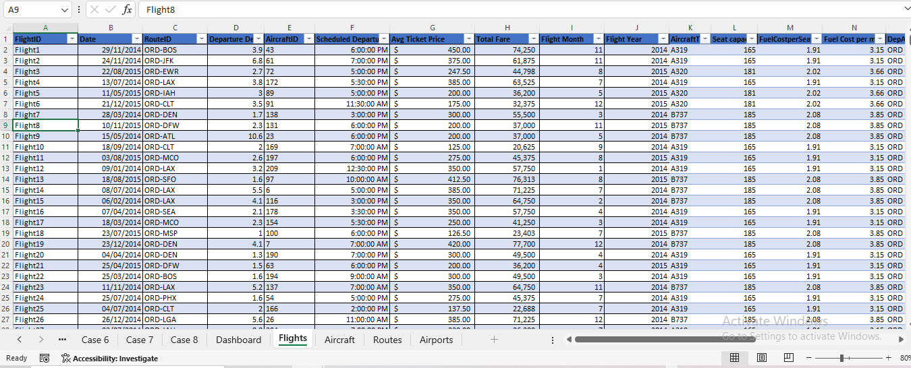
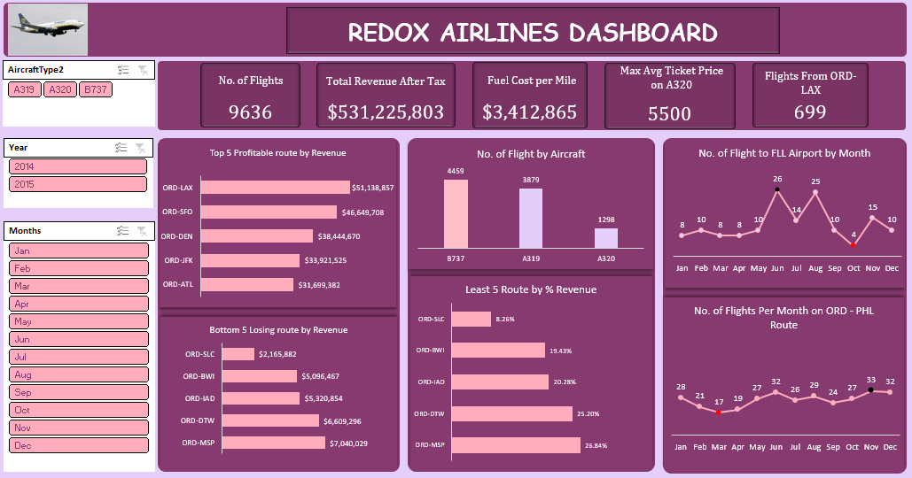

# REDOX-Airlines

### AirPlane Analysis

## Introduction

This Excel project aims to provide insights into the performance of REDOX Airlines company over the years. By analzing various aspects of the data, we seek to reduce redundance, identify sales trends, monitor the Aircraft through tracking and monitoring of KPIS and make data driven recommendations to drive the business growth and position in the industry.

## Objective
Here are ideas of how these reports will be used:

- To create Pivot Tables and Pivot Charts.
- To analyze the data and present key insights to drive the business growth.   
- To give actionable recommendation.

## Data Sources
The Primary dataset used for this project is the Flights data, Aircraft data, Routes data and Airports data containing detailed information about the revenue made, routes and aircraft of the company.

## Problem statement / Requirement.

The airline's management team has a strong airline operations background, but the current data setup is messy and inefficient. Getting specific aircraft details such as route and seating capacity requires comparing multiple files, slowing down operations. This disjointed system prevents quick and informed decision-making. For a start, a couple of numbers have been identified to be reported in their data as reports.

A one page dashboard

Case 1
  - How many flights use the A319 aircraft?
  - What is the most common type of aircraft across all flights?
  - What is the maximum average ticket price for flights on the A320 aircraft?

Case 2
  - Show the fuel cost per mile in Dollars (hint: Aircraft table)
  - Show the total revenue per flight, assuming a 10% tax on all fares (hint:Flights table)

Case 3
  - Where are we losing the most money?

Case 4
  - Where are we most profitable?

Case 5
  - How many flights are flown from O'Hare (ORD) to Los Angeles International Airport (LAX)?

Case 6
  - Which route accounts for the lowest percentage of total revenue?

Case 7
  - What was the most popular month to fly to Fort Lauderdale (FLL)?

Case 8
  - Create a visual representation to show the number of flights per month on the ORD-PHL route

## Skills/ Concepts demonstrated:
-  Excel advance formulas(Sum, INDEX MATCH, Multiplication, TEXT)
-  Pivot Tables
-  Pivot Charts

## Data Cleaning and Transformation 
Four dataset was provided for this project which are the **_Flights data_**, **_Aircraft data_**, **_Routes data_** and **_Airports data_**. The following data cleaning was done on the dataset as this will help in getting accurate results for our visualisation. 

Understanding the dataset first was a crusial part of this project and the following cleaning was done.
-  Data type was changed
-  The four dataset was merged as one using the INDEX MATCH excel formula to form a single dataset.
-  A new column was created to get the day name of the week.

## Modelling:
The four dataset was merged as one using the INDEX MATCH excel formula to form a single dataset.

There are 3 dimenstion tables and 1 fact table. The dimension tables are all joined to the fact tables.

## Visualization:

This is a one page excel dashboard of Redox Airlines analysis.

## Analysis:

Here, we could discover the following insights.

## Insights
1.  Flight Overview: The data is a 2 years data (2014 and 2015), the airline operated a total of 9,636 flights, with three aircraft types—B737, A319, and A320.
  - A total number of 3,879 flights used the A319 aircraft. The B737 emerged as the most commonly used aircraft with a total of 4,459 flights.
  - The highest average ticket price for A320 flights, reaching $5,500.

2.  Financial Overview: The airline's total revenue after tax stood impressively at $531,225,803. Fuel costs were significant, amounting to $3,412,865 per mile.
  - The B737 aircraft type proved to be the most financially rewarding, contributing $259,200,629 in revenue with a remarkable 49% growth.

4.  Route Performance: The ORD-LAX route displayed a high performance, securing the highest revenue at $51,138,857, ORD-SFO followed closely with $46,649,708, while ORD-SLC reported the     lowest revenue among the routes, amounting to $2,165,882.
  - Also, the ORD-SLC route held the lowest percentage of total revenue at 0.41%.

6.  Fort Lauderdale Airport (FLL): FLL experienced its peak in flight demand during June, with a total of 26 flights, making it the most popular month for air travel to this destination.
  - October witnessed the lowest flight demand, with only 4 flights recorded.

7.  ORD - PHL Route: The ORD - PHL route observed a surge in flight demand during November, with a total of 33 flights, marking it the most popular month for air travel on this specific     route.
  - March reported the lowest demand, with only 17 flights recorded during the period.

## Recommendations:
  - Redox Airlines should strategically focus on marketing and services for the B737, given its consistent profitability.
  - Investigate the success factors at LAX and consider replicating strategies in other airports.
  - Explore expansion opportunities on the ORD-PHL route, especially during the high-demand month of November.
  - Implement targeted promotions during low-demand months, such as October, to stimulate flight bookings.
  - Analyze factors contributing to FLL's popularity in June and consider adapting strategies for other months or locations.
  - Devise initiatives to increase revenue on the ORD-SLC route, addressing its current low contribution to overall revenue.

You can interact with the dashboard  
[here](https://1drv.ms/x/s!AnzTT-iwuQmzglgohvON5u3157s0)

You can connect with me 

